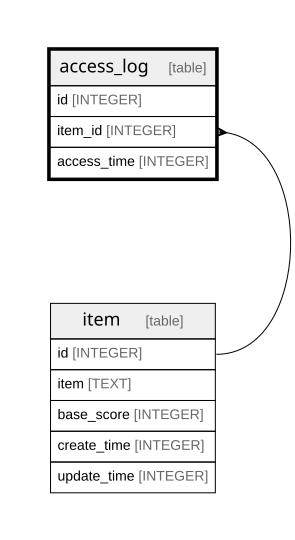

# access_log

## Description

<details>
<summary><strong>Table Definition</strong></summary>

```sql
CREATE TABLE access_log (
  id INTEGER PRIMARY KEY NOT NULL,
  item_id INTEGER NOT NULL REFERENCES item(id) ON DELETE CASCADE,
  access_time INTEGER NOT NULL
) STRICT
```

</details>

## Columns

| Name | Type | Default | Nullable | Children | Parents | Comment |
| ---- | ---- | ------- | -------- | -------- | ------- | ------- |
| id | INTEGER |  | false |  |  |  |
| item_id | INTEGER |  | false |  | [item](item.md) |  |
| access_time | INTEGER |  | false |  |  |  |

## Constraints

| Name | Type | Definition |
| ---- | ---- | ---------- |
| id | PRIMARY KEY | PRIMARY KEY (id) |
| - (Foreign key ID: 0) | FOREIGN KEY | FOREIGN KEY (item_id) REFERENCES item (id) ON UPDATE NO ACTION ON DELETE CASCADE MATCH NONE |

## Indexes

| Name | Definition |
| ---- | ---------- |
| access_log_item_time_idx | CREATE INDEX access_log_item_time_idx<br />  ON access_log (item_id, access_time) |

## Relations



---

> Generated by [tbls](https://github.com/k1LoW/tbls)
