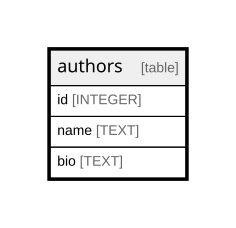

# authors

## Description

<details>
<summary><strong>Table Definition</strong></summary>

```sql
CREATE TABLE authors (
  id integer PRIMARY KEY AUTOINCREMENT,
  name text NOT NULL,
  bio text
)
```

</details>

## Columns

| Name | Type | Default | Nullable | Children | Parents | Comment |
| ---- | ---- | ------- | -------- | -------- | ------- | ------- |
| id | INTEGER |  | true |  |  |  |
| name | TEXT |  | false |  |  |  |
| bio | TEXT |  | true |  |  |  |

## Constraints

| Name | Type | Definition |
| ---- | ---- | ---------- |
| id | PRIMARY KEY | PRIMARY KEY (id) |

## Relations



---

> Generated by [tbls](https://github.com/k1LoW/tbls)
