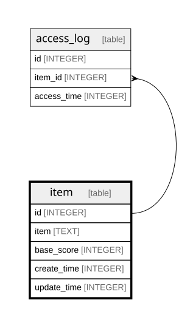

# item

## Description

<details>
<summary><strong>Table Definition</strong></summary>

```sql
CREATE TABLE item (
  id INTEGER PRIMARY KEY NOT NULL,
  item TEXT NOT NULL UNIQUE,
  base_score INTEGER NOT NULL,
  create_time INTEGER NOT NULL,
  update_time INTEGER NOT NULL
) STRICT
```

</details>

## Columns

| Name | Type | Default | Nullable | Children | Parents | Comment |
| ---- | ---- | ------- | -------- | -------- | ------- | ------- |
| id | INTEGER |  | false | [access_log](access_log.md) |  |  |
| item | TEXT |  | false |  |  |  |
| base_score | INTEGER |  | false |  |  |  |
| create_time | INTEGER |  | false |  |  |  |
| update_time | INTEGER |  | false |  |  |  |

## Constraints

| Name | Type | Definition |
| ---- | ---- | ---------- |
| id | PRIMARY KEY | PRIMARY KEY (id) |
| sqlite_autoindex_item_1 | UNIQUE | UNIQUE (item) |

## Indexes

| Name | Definition |
| ---- | ---------- |
| sqlite_autoindex_item_1 | UNIQUE (item) |

## Relations



---

> Generated by [tbls](https://github.com/k1LoW/tbls)
