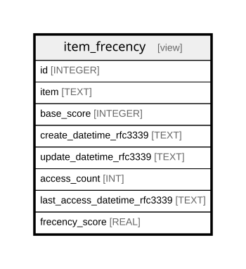

# item_frecency

## Description

<details>
<summary><strong>Table Definition</strong></summary>

```sql
CREATE VIEW item_frecency AS
SELECT
  i.id,
  i.item,
  i.base_score,
  CAST(strftime('%Y-%m-%dT%H:%M:%SZ', i.create_time, 'unixepoch') AS TEXT)
    AS create_datetime_rfc3339,
  CAST(strftime('%Y-%m-%dT%H:%M:%SZ', i.update_time, 'unixepoch') AS TEXT)
    AS update_datetime_rfc3339,
  COUNT(l.id) AS access_count,
  CASE
    WHEN MAX(l.access_time) IS NULL THEN NULL
    ELSE CAST(
      strftime('%Y-%m-%dT%H:%M:%SZ', MAX(l.access_time), 'unixepoch') AS TEXT
    )
  END
    AS last_access_datetime_rfc3339,
  CAST(
    i.base_score + COALESCE(
      SUM(
        1.0 / (1.0 + MAX(unixepoch() - l.access_time, 0) / 604800.0)
      ),
      0
    ) AS REAL
  ) AS frecency_score
FROM item AS i
LEFT JOIN access_log AS l
  ON l.item_id = i.id
GROUP BY
  i.id,
  i.item,
  i.base_score,
  i.create_time,
  i.update_time
```

</details>

## Columns

| Name | Type | Default | Nullable | Children | Parents | Comment |
| ---- | ---- | ------- | -------- | -------- | ------- | ------- |
| id | INTEGER |  | true |  |  |  |
| item | TEXT |  | true |  |  |  |
| base_score | INTEGER |  | true |  |  |  |
| create_datetime_rfc3339 | TEXT |  | true |  |  |  |
| update_datetime_rfc3339 | TEXT |  | true |  |  |  |
| access_count |  |  | true |  |  |  |
| last_access_datetime_rfc3339 |  |  | true |  |  |  |
| frecency_score | REAL |  | true |  |  |  |

## Referenced Tables

| Name | Columns | Comment | Type |
| ---- | ------- | ------- | ---- |
| [item](item.md) | 5 |  | table |
| [access_log](access_log.md) | 3 |  | table |

## Relations



---

> Generated by [tbls](https://github.com/k1LoW/tbls)
