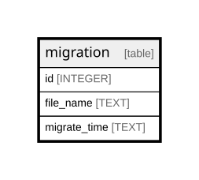

# migration

## Description

<details>
<summary><strong>Table Definition</strong></summary>

```sql
CREATE TABLE migration (
            id INTEGER PRIMARY KEY,
            file_name TEXT NOT NULL UNIQUE,
            migrate_time TEXT NOT NULL
        ) STRICT
```

</details>

## Columns

| Name | Type | Default | Nullable | Children | Parents | Comment |
| ---- | ---- | ------- | -------- | -------- | ------- | ------- |
| id | INTEGER |  | true |  |  |  |
| file_name | TEXT |  | false |  |  |  |
| migrate_time | TEXT |  | false |  |  |  |

## Constraints

| Name | Type | Definition |
| ---- | ---- | ---------- |
| id | PRIMARY KEY | PRIMARY KEY (id) |
| sqlite_autoindex_migration_1 | UNIQUE | UNIQUE (file_name) |

## Indexes

| Name | Definition |
| ---- | ---------- |
| sqlite_autoindex_migration_1 | UNIQUE (file_name) |

## Relations



---

> Generated by [tbls](https://github.com/k1LoW/tbls)
